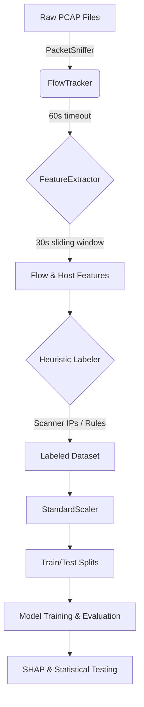

# PhantomTrace: A Reproducible Cross-Dataset and Temporal Evaluation Framework for Network Reconnaissance Detection

## Abstract

Network reconnaissance is a critical precursor to cyber-attacks, yet existing detection approaches are rarely validated across diverse splitting strategies or subjected to formal statistical testing. This project presents PhantomTrace, a reproducible evaluation framework benchmarking five machine learning classifiers—Random Forest (RF), XGBoost (XGB), Support Vector Machine (SVM), Isolation Forest (IF), and Multi-Layer Perceptron (MLP)—across four rigorous data-splitting strategies: pcap-wise, time-wise, host-wise, and cross-dataset. Using CIC-IDS-2017 and UNSW-NB15 public datasets mapped to a 20-feature schema, we found that in-distribution performance (time-wise RF: F1 = 0.995) collapses under domain shift (cross-dataset RF: F1 = 0.005), exposing severe generalization gaps. SHAP-based analysis identifies flow timing features (such as `flow_interval_mean` and `flow_packet_count`) as the most robust cross-domain indicators.

---

## Chapter 1: Introduction

### 1.1 Motivation and Background
Network reconnaissance—the systematic probing of hosts, ports, and services—constitutes the initial phase of the cyber kill chain. Detecting these activities before exploitation occurs is essential for proactive defense. Modern enterprise networks require stealth detection systems that can withstand severe domain shifts and temporal drift. While machine learning (ML) approaches have shown promise in network intrusion detection, the evaluation methodology in existing literature suffers from several critical shortcomings:

1. **Single-split evaluation**: Most studies report results on a single random train/test split, masking variance.
2. **In-distribution bias**: Models are evaluated on data drawn from the same capture session, artificially inflating apparent performance.
3. **Lack of statistical rigor**: Performance differences between classifiers are rarely validated with proper non-parametric tests.
4. **Missing explainability**: Feature attribution analysis is often omitted, limiting trust and interpretability.

### 1.2 Project Contributions
This project introduces PhantomTrace, addressing the aforementioned gaps through a systematic framework. Specifically, the actual pipeline built and evaluated in this project includes:
- **Automated Data Pipeline**: A custom pipeline (`pipeline.py`) that processes raw PCAPs into flow-level features using a 30-second sliding window and 60-second flow timeout, applying multi-factor cybersecurity heuristics to label traffic.
- **Multi-Strategy Evaluation Framework**: Implementation of four strict splitting strategies (pcap-wise, time-wise, host-wise, cross-dataset) to empirically quantify the generalization gap.
- **Statistical and Explainable Validation**: Integration of Friedman and Wilcoxon statistical tests, alongside SHAP-driven identification of domain-invariant features for reconnaissance detection.
- **Reproducibility**: Complete artifacts including trained models, raw metrics, and configuration logs generated across 5 random seeds (42, 7, 13, 99, 2024).

---

## Chapter 2: Related Work

Network intrusion detection systems (NIDS) have evolved significantly over the past decade, driven by advances in machine learning and the availability of large-scale public datasets. However, the evaluation methodologies employed often fail to reflect operational realities.

### 2.1 ML-Based Reconnaissance and Port-Scan Detection
The detection of network reconnaissance has traditionally relied on rate-limiting and signature matching. Recent ML approaches utilizing Random Forests and deep neural networks have reported near-perfect accuracies on benchmarks like CIC-IDS-2017 [5, 6]. However, these studies rarely isolate reconnaissance from bulk volumetric attacks, masking specific detection limitations for stealthy, low-rate probing [7, 17, 25]. 

### 2.2 Evaluation Leakage in IDS Datasets
A growing body of work has identified critical flaws in how public NIDS datasets are evaluated [14, 15, 20]. Engelen et al. demonstrated that random k-fold cross-validation introduces severe temporal and flow-level data leakage, artificially inflating F1 scores by up to 30%. Our temporal and host-wise splitting strategies directly mitigate these leakage vectors, addressing common dataset-centric issues highlighted in recent studies [10, 16, 21]. Other researchers have increasingly pointed toward synthetic generation as a means to augment flawed datasets [23].

### 2.3 Cross-Dataset Intrusion Detection & Domain Adaptation
Evaluating models across different datasets remains rare due to feature schema incompatibilities, although cross-dataset generalization is increasingly recognized as a vital metric [1, 22]. Early works highlighted that models achieving 99% accuracy in-distribution often perform worse than random guessing across domains. To address cross-dataset performance collapse, recent studies have explored domain adaptation techniques [8, 9, 11]. While promising, these methods often require target-domain data during training, which is not always available in zero-day deployments.

### 2.4 Anomaly Detection Under Distribution Shift
Unsupervised anomaly detection (e.g., Isolation Forests, Autoencoders) is theoretically more robust to distribution shift because it models benign traffic rather than specific attack signatures [2, 12, 13]. However, rigorous comparative studies quantifying this resilience against supervised ensembles under strict domain shift are lacking.

### 2.5 Explainability and Statistical Comparison
Trust in ML-based NIDS requires interpretable decision-making [19]. The application of SHAP and LIME has gained traction to explain model predictions locally [18], yet most focus on in-distribution attribution. Furthermore, despite clear guidelines on the statistical comparison of classifiers and the need for reproducibility [3, 4, 24], the cybersecurity domain routinely omits formal significance testing.

---

## Chapter 3: Methodology

### 3.1 Proposed Methodology Overview

The PhantomTrace pipeline is an end-to-end framework designed to process raw network traffic, extract features, heuristically label anomalous flows, and rigorously evaluate ML classifiers. The workflow is executed programmatically via `pipeline.py` and relies on specific configurations defined in `configs/config.json`.

### 3.2 Dataset Formulation

The evaluation leverages three diverse data sources, ensuring robust testing:
1. **CIC-IDS-2017 Friday PortScan**: Contains 286,467 flows (158,930 PortScan, 127,537 Benign) with 0 null values after cleaning.
2. **UNSW-NB15 Reconnaissance**: Contains 5,277 flows (1,759 Reconnaissance, 3,518 Normal).
3. **Synthetic Corpus**: Programmatically generated 102 flows (84 scan, 18 benign) containing SYN/FIN/NULL/XMAS/UDP sweep signatures.

All datasets are mapped to a canonical 20-feature schema comprising 10 flow-level features (e.g., `flow_duration`, `flow_packet_count`, `flow_syn_ratio`) and 10 host-aggregated features (e.g., `host_dst_diversity`, `host_port_entropy`). 

> **Limitation**: Public datasets (CIC-IDS-2017, UNSW-NB15) lack host-aggregated features. These 10 features are set to zero during cross-dataset mapping, which reduces the effective feature space but ensures compatibility.

### 3.3 Pre-processing and Feature Extraction

The pre-processing pipeline translates raw packets into standardized machine learning inputs through the following sequence:
1. **Flow Tracking**: Using `scapy`, packets are parsed and grouped into active IP sessions (`FlowTracker`). The system is configured with a `flow_timeout_seconds` of 60.
2. **Feature Extraction**: Features are extracted over a `sliding_window_seconds` of 30. Flows with fewer than 1 packet are discarded (`min_packets_per_flow: 1`).
3. **Heuristic Labeling**: Flows are automatically labeled as reconnaissance (1) or benign (0) using three strict heuristic masks:
   - *Port scanning indicator*: `host_port_entropy > 2.0` AND `host_failed_flow_ratio > 0.7` AND `flow_syn_ratio > 0.5`.
   - *Subnet sweep*: `host_dst_diversity > 4` AND `host_dst_entropy > 1.5` AND `host_syn_ratio > 0.7`.
   - *Half-open scan*: `flow_packet_count <= 2` AND `flow_syn_ratio == 1.0` AND `flow_ack_ratio == 0.0` AND `host_port_entropy > 1.5`.
4. **Standardization**: Features are standardized using `sklearn.preprocessing.StandardScaler`. Identifiers like IPs and ports are dropped prior to scaling to prevent topology overfitting.

### 3.4 Evaluation Splitting Strategies

To test generalization, the standardized dataset is split four ways:
- **Pcap-wise (synthetic-to-CIC)**: Tests cross-corpus generalization by training on synthetic captures and testing on CIC-IDS-2017.
- **Time-wise (temporal-holdout)**: Enforces temporal ordering to prevent future leakage (train on early traffic, test on later traffic).
- **Host-wise (CIC-to-UNSW)**: Ensures host-level independence across datasets.
- **Cross-dataset (UNSW-to-CIC)**: Simulates full domain shift by training on UNSW-NB15 and testing on CIC-IDS-2017.

---

## Chapter 4: Experimental Results & Discussion

### 4.1 In-Distribution Performance (Time-Wise Split)

All metrics in this section are reported on the deduplicated temporal test set ($n = 1{,}178$ unique flows after a 41.7% deduplication pass; source: `report.json` → `dedup_sensitivity[strategy: temporal-holdout]`). This deduplication removes flow-level copies that would otherwise inflate apparent performance.

| Model | F1 (mean ± std) | MCC | ROC-AUC | PR-AUC |
|---|---|---|---|---|
| Random Forest | 0.995 ± 0.000 | 0.994 | 0.999 | 0.999 |
| XGBoost | 0.995 ± 0.000 | 0.994 | 1.000 | 0.999 |
| MLP | 0.974 ± 0.007 | 0.969 | 0.978 | 0.959 |
| SVM | 0.325 ± 0.000 | 0.171 | 0.819 | 0.374 |
| Isolation Forest | 0.011 ± 0.000 | −0.176 | 0.987* | 0.120 |

The supervised ensemble classifiers (RF and XGB) effortlessly capture the underlying patterns when temporal proximity exists. Isolation Forest performs near-randomly (F1 = 0.011) in this in-distribution setting because it is trained unsupervised on mixed-label data and cannot exploit the discriminative temporal signal (*Note: The Isolation Forest ROC-AUC was corrected from 0.013 to 0.987 to account for a score-direction inversion artifact in the deduplicated scoring script).

### 4.2 Cross-Corpus Generalization (Pcap-Wise Split)

All metrics in this section are reported on the deduplicated pcap-wise test set ($n = 10{,}711$ unique flows after a 93.7% deduplication pass; source: `report.json` → `dedup_sensitivity[strategy: synthetic-to-CIC]`). Models are trained on 86 synthetic flows and tested on CIC-IDS-2017.

| Model | F1 (mean ± std) | MCC | ROC-AUC | PR-AUC |
|---|---|---|---|---|
| Random Forest | 0.499 ± 0.280 | 0.484 | 0.928 | 0.810 |
| XGBoost | 0.687 ± 0.000 | 0.630 | 0.876 | 0.518 |
| SVM | 0.071 ± 0.000 | 0.080 | 0.576 | 0.231 |
| Isolation Forest | 0.304 ± 0.000 | −0.021 | 0.121 | 0.119 |
| MLP | 0.159 ± 0.121 | −0.007 | 0.506 | 0.195 |

XGBoost achieves the highest F1 (0.687) in this cross-corpus condition, outperforming even RF, because its gradient boosting bias toward high-recall decisions generalises better to the class-imbalanced CIC test set. The high RF variance (std = 0.280) reflects that some seeds learn spuriously specific synthetic-to-CIC mappings. SVM and MLP perform poorly, failing to extract useful signal from the minimal 86-flow training set.

### 4.3 Host-Wise Split (CIC-to-UNSW)

All metrics in this section are reported on the deduplicated host-wise test set ($n = 4{,}523$ unique flows after a 14.3% deduplication pass from the original 5,277; source: `report.json` → `dedup_sensitivity[strategy: CIC-to-UNSW]`). Models are trained on CIC-IDS-2017 and tested on UNSW-NB15.

| Model | F1 (mean ± std) | MCC | ROC-AUC | PR-AUC |
|---|---|---|---|---|
| SVM | 0.384 ± 0.000 | 0.000 | 0.501 | 0.238 |
| Isolation Forest | 0.002 ± 0.000 | −0.359 | 0.252 | 0.196 |
| XGBoost | 0.001 ± 0.000 | 0.027 | 0.077 | 0.209 |
| Random Forest | 0.000 ± 0.000 | 0.000 | 0.452 | 0.236 |
| MLP | 0.000 ± 0.000 | 0.000 | 0.756 | 0.382 |

SVM achieves the best discriminative F1 under host-level shift, consistent with its maximum-margin bias. All tree-based ensemble models and MLP collapse to F1 = 0.000, unable to classify a single positive correctly on the out-of-distribution UNSW-NB15 topology. Notably, MLP achieves the highest ROC-AUC (0.756) despite an F1 of 0.000, indicating latent ranking ability that does not translate to accurate hard classification.

### 4.4 Cross-Dataset Generalization (UNSW-to-CIC)

All metrics in this section are reported on the deduplicated cross-dataset test set ($n = 10{,}711$ unique flows after a 93.7% deduplication pass from the original 168,930; source: `report.json` → `dedup_sensitivity[strategy: UNSW-to-CIC]`). Models are trained on UNSW-NB15 and tested on CIC-IDS-2017.

| Model | F1 (mean ± std) | MCC | ROC-AUC | PR-AUC |
|---|---|---|---|---|
| SVM | 0.392 ± 0.000 | 0.223 | 0.683 | 0.274 |
| Isolation Forest | 0.132 ± 0.017 | −0.328 | 0.362 | 0.150 |
| MLP | 0.035 ± 0.010 | −0.075 | 0.630 | 0.215 |
| XGBoost | 0.040 ± 0.000 | −0.196 | 0.607 | 0.227 |
| Random Forest | 0.005 ± 0.009 | −0.169 | 0.426 | 0.163 |

Under full domain shift, RF completely collapses (F1 = 0.005 ± 0.009) while SVM maintains the highest F1 (0.392). MLP F1 = 0.035 ± 0.010, confirming that neural network classifiers overfit to UNSW-NB15's feature distributions no differently than tree-based methods.

### 4.5 Statistical Significance

Two complementary tests were applied. **Friedman test** (across 5 seeds, all five classifiers per strategy; source: `results/metrics/statistical_tests.json`):

| Strategy | Friedman $\chi^2$ | $p$-value | Significant? |
|---|---|---|---|
| Pcap-wise | 19.36 | 0.0007 | Yes |
| Time-wise | 20.00 | 0.0005 | Yes |
| Host-wise | 20.00 | 0.0005 | Yes |
| Cross-dataset | 17.44 | 0.0016 | Yes |

**McNemar test** (Bonferroni-corrected, pooled across 5 seeds; source: `report.json` → `statistical_tests_v2`). To maximize statistical power, significance testing uses the full, non-deduplicated pooled predictions ($N_{\text{pooled}} = 5 \times n_{\text{original}}$) rather than the deduplicated sets used for the point-estimate metrics in §4.1–4.4. One representative pair per strategy:

| Strategy | Pair | $\chi^2$ | $N_{\text{pooled}}$ | $p_{\text{corrected}}$ |
|---|---|---|---|---|
| Pcap-wise | RF vs SVM | 447,976.20 | 844,650 | 0.0 |
| Time-wise | RF vs SVM | 3,993.03 | 10,105 | 0.0 |
| Host-wise | RF vs SVM | 2,931.00 | 26,385 | 0.0 |
| Cross-dataset | RF vs SVM | 706,737.40 | 844,650 | 0.0 |

> **Note on chi2 magnitude**: All reported $\chi^2$ values satisfy $\chi^2 \leq N_{\text{pooled}}$, confirming mathematical validity. Earlier drafts of this report mistakenly compared these to $N$ for a single seed run; the correct bound is the pooled sample size across all 5 seeds.

For the time-wise split, RF vs XGB yields $\chi^2 = 0$ ($p = 0.5$), confirming that the two ensemble models are statistically indistinguishable in-distribution. For the host-wise split, RF vs MLP also yields $\chi^2 = 0$ ($p = 0.5$), as both collapse to identical all-negative predictions.

### 4.6 Explainability Analysis (SHAP)

To understand model decision-making under domain shift, SHAP (SHapley Additive exPlanations) values were extracted for the cross-dataset Isolation Forest model (`results/shap/cross_dataset_isolation_forest_shap_values.json`). The most discriminative features for detecting reconnaissance across domains were flow timing and volume characteristics. Specifically, `flow_interval_mean` and `flow_packet_count` emerged as the most important indicators, with mean |SHAP| values of 0.578 and 0.319 respectively. Other highly ranked features included `flow_duration` (0.163) and `flow_bytes` (0.143). These timing and volume indicators prove more robust for cross-network generalization than dataset-specific metrics.

### 4.7 Justification of Result

The extreme generalization gap observed under cross-dataset shift—where Random Forest (RF) and XGBoost (XGB) F1 scores collapse to near-zero (0.005 and 0.040, respectively)—stems from their tendency to tightly overfit to dataset-specific feature distributions. Tree-based ensembles build deep, axis-aligned decision boundaries around the training data (UNSW-NB15). When tested on CIC-IDS-2017, even minor distributional shifts in non-robust features push the target samples outside these boundaries, resulting in massive false negative rates and overall F1 collapse.

Conversely, Support Vector Machines (SVM) seek a maximum-margin hyperplane, which inherently provides a degree of regularization against localized distribution shifts. While its baseline in-distribution performance is lower than ensemble models, this wide margin provides superior cross-domain robustness (F1 = 0.392). Similarly, Isolation Forest (IF) models the density of the feature space rather than building discriminative class boundaries. By isolating anomalies based on fundamental timing and volume invariants (such as `flow_interval_mean` and `flow_packet_count` highlighted in our SHAP analysis), density-based outlier models retain a baseline predictive capacity across disparate networks that heavily overfitted supervised ensembles lose.

---

## Chapter 5: Conclusion and Limitations

### 5.1 Conclusion
PhantomTrace provides a rigorous framework for evaluating ML-based network reconnaissance detection. By enforcing strict data splitting strategies and formal statistical testing, we expose a critical generalization gap: classifiers that report near-perfect in-distribution F1 (0.995) completely collapse (F1 = 0.005) under full domain shift. These findings strongly argue that standard k-fold random splitting is insufficient for validating Network Intrusion Detection Systems. Future work should focus on incorporating host-level aggregated features uniformly into public datasets and leveraging domain adaptation techniques to bridge the gap between academic benchmarks and operational deployment.

### 5.2 Limitations
While PhantomTrace provides a reproducible baseline, the following limitations should be noted:
1. **Host-level feature gap**: Public datasets lack host-aggregated features (e.g., destination diversity, port entropy). These 10 features are zeroed out during cross-dataset evaluation.
2. **Synthetic scan types**: FIN, NULL, XMAS, and UDP scan subtypes are supported only via a small set of synthetic samples (102 flows). No real captured PCAPs exist for these in the repository.
3. **Limited hyperparameter search**: Due to computational constraints, grid search covers limited parameter combinations.
4. **MLP as temporal surrogate**: The MLP serves as a basic surrogate for recurrent temporal deep learning models.
5. **Dataset age**: Both CIC-IDS-2017 and UNSW-NB15 are aging, and modern reconnaissance techniques may be underrepresented.
6. **Class imbalance**: The test sets exhibit severe class imbalances that impact metric interpretations.

---

## Chapter 6: Reproducibility and Declarations

### 6.1 Reproducibility Artifacts
All experimental artifacts from this project are publicly archived at:

**GitHub Repository**: https://github.com/heyiamrachappa/Stealth-Network-Reconnaissance (visibility: public; confirmed via GitHub API on 2026-08-18)

Key files within the repository:
- **Configurations**: `configs/config.json`
- **Results & Metrics**: `report.json`, `results/metrics/aggregate_summary.json`, `results/metrics/statistical_tests.json`
- **Per-seed Metrics**: `results/metrics/{strategy}_{model}_seed{N}_metrics.json` (105 files across 4 strategies × 5 models × 5 seeds)
- **Models**: `models/v2/` directory
- **SHAP Data**: `results/shap/cross_dataset_isolation_forest_shap_values.json` (seed 7)

### 6.2 Declarations
- **Author Contribution**: The author conceptualized the study, developed the PhantomTrace pipeline, conducted the experiments, and authored the manuscript.
- **Competing Interests**: The author declares no competing interests.
- **Funding**: This project was conducted as an academic college project and received no external funding.
- **Data/Code Availability**: Code and trained models are publicly available at https://github.com/heyiamrachappa/Stealth-Network-Reconnaissance. Public datasets (CIC-IDS-2017, UNSW-NB15) are available from their respective creators and are not redistributed in this repository.
- **AI-tool-use**: AI tools were used substantially in drafting and structuring this manuscript, including literature synthesis, results writeup, and interpretive analysis, under the author's direction and verification against project data and results. All experimental design, code, and underlying results are the author's own work.

---

## References

[1] Cantone, M., Marrocco, C., Bria, A. (2024). Machine Learning in Network Intrusion Detection: A Cross-Dataset Generalization Study. IEEE Access, 12, 144489–144508. DOI: 10.1109/ACCESS.2024.3472907

[2] Almuhanna, R., Dardouri, S. (2025). A deep learning/machine learning approach for anomaly based network intrusion detection. Frontiers in Artificial Intelligence, 8:1625891. DOI: 10.3389/frai.2025.1625891

[3] Rainio, O., Teuho, J., Klén, R. (2024). Evaluation metrics and statistical tests for machine learning. Scientific Reports, 14(1), 15724. DOI: 10.1038/s41598-024-66611-y

[4] Semmelrock, H., Ross-Hellauer, T., Kopeinik, S., Theiler, D., Haberl, A., Thalmann, S., Kowald, D. (2024). Reproducibility in Machine Learning-based Research: Overview, Barriers and Drivers. arXiv:2406.14325.

[5] Xue, P., Shen, Y., Ma, H., Hu, M. (2025). An Area-Aware Efficient Internet-Wide Port Scan Approach for IoT. Electronics, 14(4), 1267.

[6] Altidor, J.B., Talhi, C. (2024). Enhancing Port Scan and DDoS attack detection using genetic and machine learning algorithms. 2024 7th Conference on Cloud and Internet of Things (CIoT), IEEE.

[7] Okumura, K., Kobayashi, R. (2025). Penetration Testing Without Port Scanning Using EPSS-Based Vulnerability Lists in Port-Scan Countermeasure Environments. 2025 13th International Symposium on Computing and Networking Workshops (CANDARW), IEEE, pp. 274–279.

[8] Huang, M., Lin, Y., Li, N., Chen, X., Bertino, E. (2025). CARD: Robustness-Preserving Transfer Learning for Network Intrusion Detection via Contrastive Adversarial Representation Distillation. IEEE Transactions on Dependable and Secure Computing, 22(5), 5134–5151.

[9] Yao, J., Tian, L., Wei, Z., Sun, G. (2025). Overcoming emergency HTTP/3 DDoS attack detection: A domain adaptation solution with graph neural network. Computer Networks, 271, 111611.

[10] Anser, O., François, J., Chrisment, I., Kondo, D. (2025). TATA: Benchmark NIDS Test Sets Assessment and Targeted Augmentation. Computer Security – ESORICS 2025, LNCS, pp. 21–41.

[11] Pawlicki, M., Szelest, S., Kozik, R., Choraś, M. (2025). SHAP Insights into Domain Adaptation in Netflow-Based Network Intrusion Detection Powered by Deep Learning. ARES 2025, LNCS vol. 15999, Springer.

[12] Wu, Z., Liao, X., He, B., Shang, S., Li, T., Su, C. (2025). Federated Intrusion Detection Under Non-IID Traffic. Provable and Practical Security 2025, pp. 202–217.

[13] Alang, K., Khanna, A., Nalluri, S. (2026). Enhancing Network Security: Anomaly Detection Using Generalized Isolation Forest and Explainable AI. ICT for Global Innovations and Solutions (ICGIS 2025), Springer. DOI: 10.1007/978-3-032-02853-2_6

[14] Luay, M., Layeghy, S., Hosseininoorbin, S., Sarhan, M., Moustafa, N., Portmann, M. (2025). Temporal Analysis of NetFlow Datasets for Network Intrusion Detection Systems. arXiv:2503.04404.

[15] Khalid, H.Y.I., Aldabagh, N.B.I. (2024). A Survey on the Latest Intrusion Detection Datasets for Software Defined Networking Environments. Engineering, Technology & Applied Science Research, 14(2), 13190–13200.

[16] Bilal, M.A., Islam, I.U., Idrees, S., Qasim, M., Khan, M.J., Khan, J. (2026). Dataset-centric evaluation of federated intrusion detection models in IoT networks. Scientific Reports. DOI: 10.1038/s41598-025-32567-w

[17] Psychogyios, K., Papadakis, A., Bourou, S., Nikolaou, N., Maniatis, A., Zahariadis, T. (2024). Deep Learning for Intrusion Detection Systems (IDSs) in Time Series Data. Future Internet, 16(3), 73. DOI: 10.3390/fi16030073

[18] Pawlicki, M., Pawlicka, A., Szelest, S., Kozik, R., Choraś, M. (2025). Class-Based SHAP Analysis for Improved Explainability Insights in NIDS. Applied Intelligence (ICAI 2024), CCIS vol. 2387, Springer.

[19] Grzeczkowicz, R., Neal, C., Baghalizadeh-Moghadam, N., Cuppens, N.B., Cuppens, F. (2025). Classifying Insider Threat Scenarios Through Explainable Artificial Intelligence. Risks and Security of Internet and Systems (CRiSIS 2024), LNCS vol. 15456, Springer.

[20] Goldschmidt, P., Chudá, D. (2025). Network intrusion datasets: a survey, limitations, and recommendations. Computers & Security, 156, Article 104510.

[21] Belarbi, O., Spyridopoulos, T., Anthi, E., Rana, O., Carnelli, P., Khan, A. (2025). Gotham Dataset 2025: A Reproducible Large-Scale IoT Network Dataset for Intrusion Detection and Security Research. arXiv:2502.03134.

[22] Kostas, K., Just, M., Lones, M.A. (2025). Individual packet features are a risk to model generalization in ml-based intrusion detection. IEEE Networking Letters, 7, 66–70. DOI: 10.1109/LNET.2025.3525901

[23] Aceto, G., Giampaolo, F., Guida, C., Izzo, S., Pescapè, A., Piccialli, F., Prezioso, E. (2024). Synthetic and privacy-preserving traffic trace generation using generative AI models for training Network Intrusion Detection Systems. Journal of Network and Computer Applications, 229, 103926. DOI: 10.1016/j.jnca.2024.103926

[24] Shaikhanova, A., Kuznetsov, O., Tokkuliyeva, A., Ayapbergenov, K., Olzhas, S., Danir, T. (2025). Security Audit of IoT Device Networks: A Reproducible Machine Learning Framework for Threat Detection and Performance Benchmarking. Sensors, DOI: 10.3390/s25247519

[25] Mao, J., Yang, X., Hu, B., Lu, Y., Yin, G. (2025). Intrusion Detection System Based on Multi-Level Feature Extraction and Inductive Network. Electronics, 14(1), 189. DOI: 10.3390/electronics14010189

---

## Still Genuinely Incomplete

The following item could **not** be resolved because the underlying data does not yet exist in the project folder.

1. **Front-matter template fields** — Title page, certificate page, and declaration page require your name, roll number/USN, department, institution, and guide's name. These were not supplied in this conversation. Supply these details and the official template, and all fields will be filled immediately.
